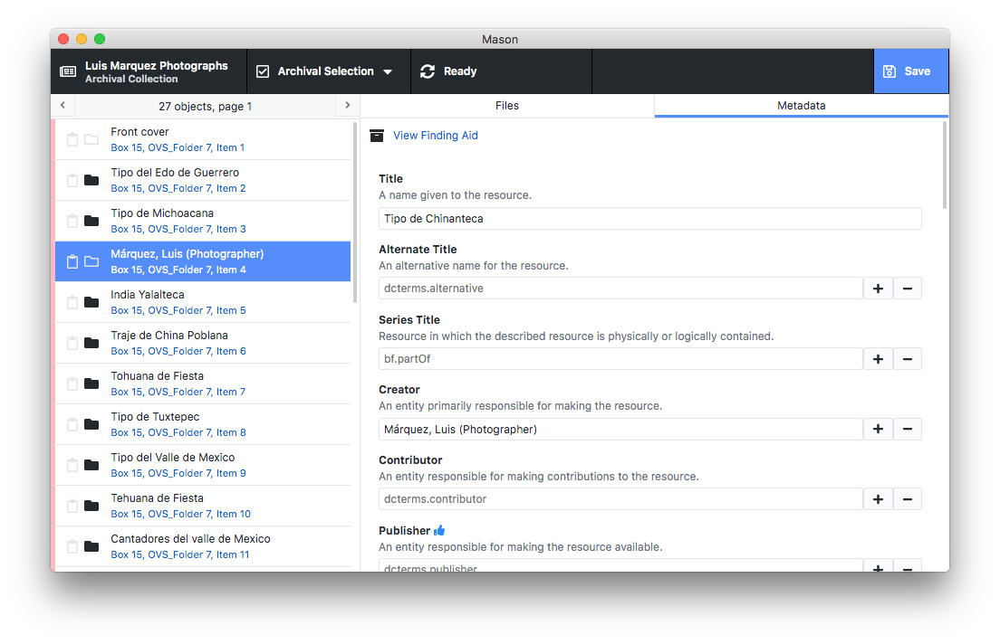

# Mason

Mason is an ingest tool that allows archival curators, metadata specialists, digitization technicians, and preservation administrators to organize digitized content into hierarchies that preserve the contextual linkages and provenance of the original archival collection. In addition, provide metadata specialists the ability to validate and add descriptive metadata to access and preservation objects. The tool allows for easy batch ingest preparation--creating nested directory structures and automatically organizing files in such a way that the resultant Archivematica-compatible SIP seamlessly replicates the physical arrangement of the original collection. The tool eliminates the need for manually creating directories or moving files, making it ideal for large-scale workflows. The tool also has the capacity to mint package-specific ARKs, allowing the preservation and access packages to have a persistent identifier that connects preservation master files to access objects and vice versa.



### Access Files

In order to create access files you must install [ImageMagick](https://www.imagemagick.org/index.php.

[Download ImageMagick for Windows](https://www.imagemagick.org/script/binary-releases.php#windows)

MacOS via [Homebrew](https://brew.sh/):
```
brew install imagemagick
```

### Development Scripts

The use of the [yarn](https://yarnpkg.com/) package manager is strongly recommended, as opposed to using `npm`.

```bash
# run application in development mode
yarn dev

# compile source code and create webpack output
yarn compile

# `yarn compile` & create build with electron-builder
yarn release

# `yarn compile` & create build & distribute release
yarn dist
```

[Electron](https://electronjs.org/) main process is at `src/main/index.ts` and the renderer process is at `src/renderer/index.ts`. This application is written in [TypeScript](https://www.typescriptlang.org/) and uses [React](https://reactjs.org/).

## License

**[MIT License](LICENSE)**

